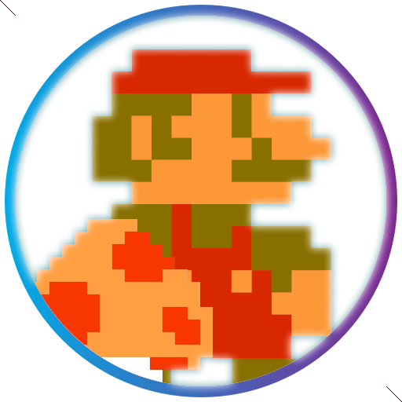

# ClonSuperMario - Nivel 1



## Descripción

Este es un clon simple del juego clásico **Super Mario**, enfocado en la recreación del **Nivel 1**. En esta versión, hemos incluido muchos de los elementos característicos del juego, como los enemigos, monedas, y power-ups, pero las tuberías aún no están implementadas.

## Características

- 🌟 **Recreación del Nivel 1** de Super Mario.
- 👾 Enemigos clásicos como Goombas y Koopas.
- 🍄 Power-ups, incluyendo el **Fire Flower** que transforma a Mario en **Super Mario**.
- 🎮 Controles básicos que permiten saltar y correr.
- ❌ Las tuberías no están implementadas (todavía en desarrollo).

## Instalación

Para ejecutar este proyecto localmente, sigue estos pasos:

1. Clona este repositorio:

   
```
   git clone https://github.com/DiegoP2001/SuperMarioClon
```


2. Ve al directorio del proyecto:

```
cd ClonSuperMario
```

3. Abre el archivo index.html en tu navegador para jugar.

### Controles
    Moverse: Usa las flechas del teclado
    Saltar: Usa la flecha ⭡ del teclado.
    Lanzar bolas de fuego: Pulsa la tecla Espacio.


### Estado del Proyecto
Este proyecto está en fase de desarrollo. Actualmente, solo está implementado el Nivel 1, y las tuberías no están funcionales. Los próximos pasos son:

 Implementar tuberías funcionales.
 Añadir más niveles.
 Mejorar la inteligencia de los enemigos.

### Contribuir

Las contribuciones son bienvenidas. Si deseas ayudar a mejorar el proyecto, puedes seguir estos pasos:

1. Haz un fork del proyecto.
2. Crea una nueva rama (git checkout -b feature/nueva-funcionalidad).
3. Realiza tus cambios y haz un commit (git commit -m 'Añadir nueva funcionalidad').
4. Haz push a tu rama (git push origin feature/nueva-funcionalidad).
5. Abre un Pull Request.


#### Créditos
Este proyecto fue desarrollado utilizando el framework Phaser, un potente motor de desarrollo de juegos en 2D.

### Licencia
Este proyecto está bajo la licencia MIT.


### Instrucciones para el logo de Super Mario:

1. Si tienes el logo de Super Mario, guárdalo en una carpeta llamada `assets` dentro del directorio del proyecto.
2. En la línea ``, asegúrate de que la ruta sea correcta.
